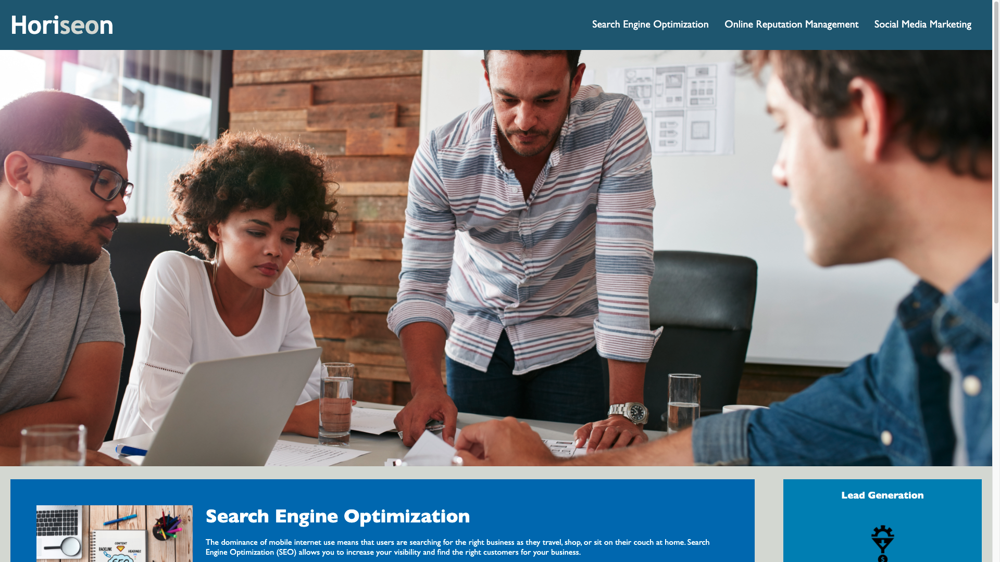
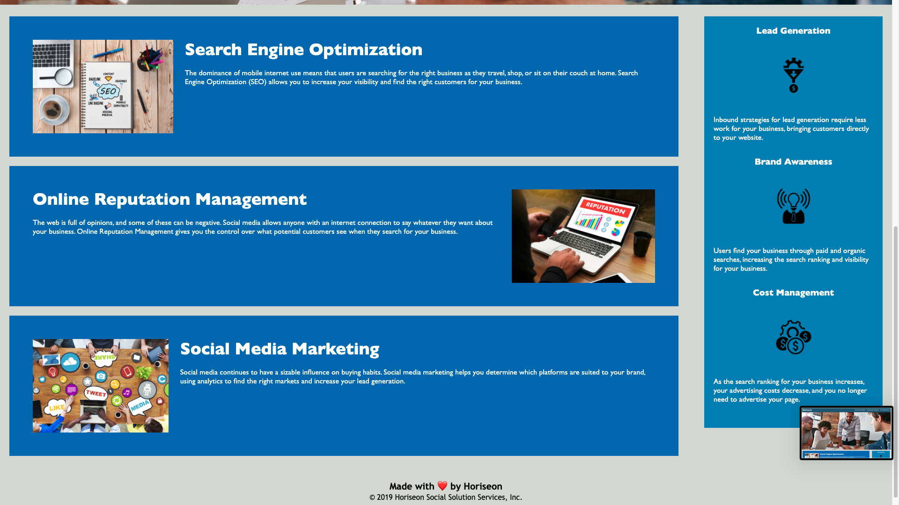

# Horiseon Website Accesibility Revamp
> This web development revamp is to increase user and developer accesibility. I have been hired by Horiseon to review and adjust codebase to follow accesibility standards so that thier own side is optimized for search engines.

## Table of contents
* [General info](#general-info)
* [Team members](#team-members)
* [Technologies](#technologies)
* [Screenshots](#screenshots)
* [View updates](#view-updates)
* [Suggestions](#suggestions)

## General info
Accesibility is key in making our world, especially our vitrual world, a better place. Thank you for your commitment in wanting to make your website more accesible and sustainable for growth as your business grows. In this revamp I have completed the following to increase accesibility for both the user and developer: reviewed and adjusted source code and structure; added alt text to site images; reviewed and adjusted proper heading and text sequence; etc.

## Team members 
Jonathan G. Flores :technologist: 
>You can find me on [Linkedin](https://www.linkedin.com/in/brownradical "Add me on Linkedin") or email me at <jgflores35@gmail.com>
	
## Technologies 
Project is created with :computer: :
* Visual Studio Code version: 1.54.3
* Terminal version: 2.11
* Google Chrome version: 89.0.4389.72
* GitHub

## Screenshots 
The following screenshots are what the website currently looks like :camera_flash: :

	
## View updates
To view the website live, go to: https://brownradical.github.io/horiseon/ or to open Github repository files on a browser, go to: https://github.com/brownradical/horiseon.git

## Suggestions
The following are suggestions for the website that can increase accesibility and business growth:
* Privacy Policy
* Further content on services offered
* Dynamic and mobile support
* Interest form
* Further CSS styling