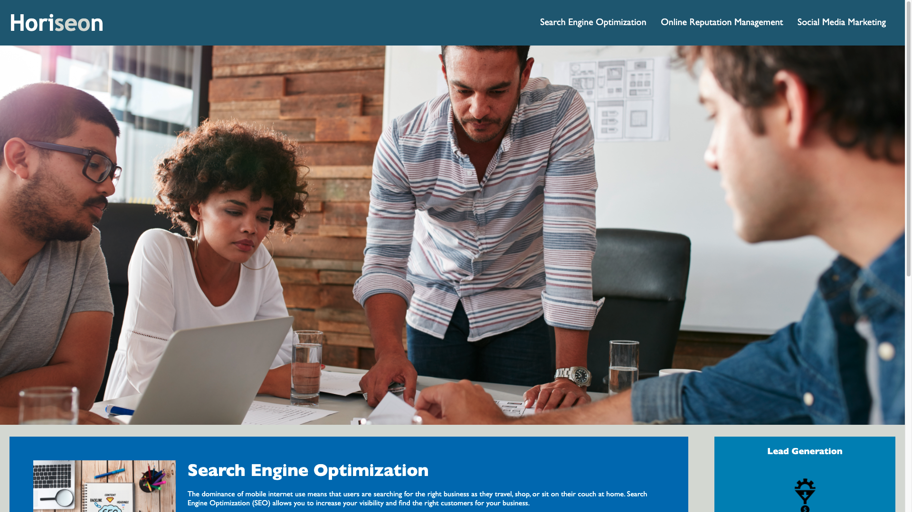
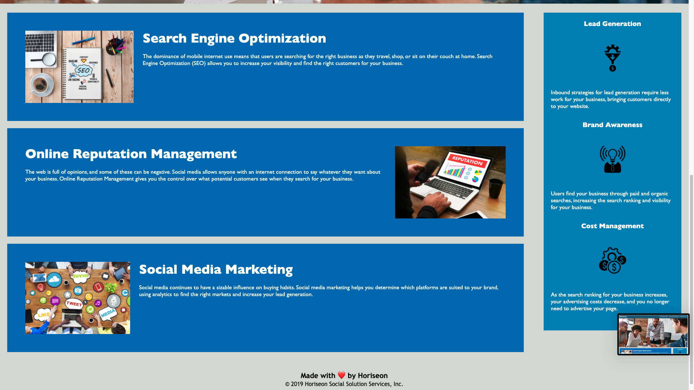

# Horiseon Website Accesibility
> This web development revamp is to increase user and developer accesibility.

## Table of contents
* [General info](#general-info)
* [Team members](#team-members)
* [Technologies](#technologies)
* [Screenshots](#screenshots)
* [Setup](#setup)

## General info
Accesibility is key in making our world, especially our vitrual world, a better place. Thank you for your commitment in wanting to make your website more accesible and sustainable for growth as your business grows. In this revamp I have completed the following to increase accesibility for both the user and developer: reviewed and adjusted source code and structure; added alt text to site images; reviewed and adjusted proper heading and text sequence; etc.

## Team members :technologist:
"Jonathan G. Flores" <jgflores35@gmail.com>

<!-- Actual text -->

You can find me on [![Twitter][1.2]][1], or on [![LinkedIn][2.2]][2].

<!-- Icons -->

[1.2]: http://i.imgur.com/wWzX9uB.png (twitter icon without padding)
[2.2]: https://raw.githubusercontent.com/MartinHeinz/MartinHeinz/master/linkedin-3-16.png (LinkedIn icon without padding)

<!-- Links to your social media accounts -->

[1]: https://twitter.com/brownradical
[2]: https://www.linkedin.com/in/brownradical

	
## Technologies :computer:
Project is created with:
* Visual Studio Code version: 1.54.3
* Terminal version: 2.11
* Google Chrome version: 89.0.4389.72
* GitHub

## Screenshots :camera_flash:
The following screenshots are what the website currently looks like:


	
## Setup
To run this project, install it locally using npm:

```
$ cd ../lorem
$ npm install
$ npm start
```